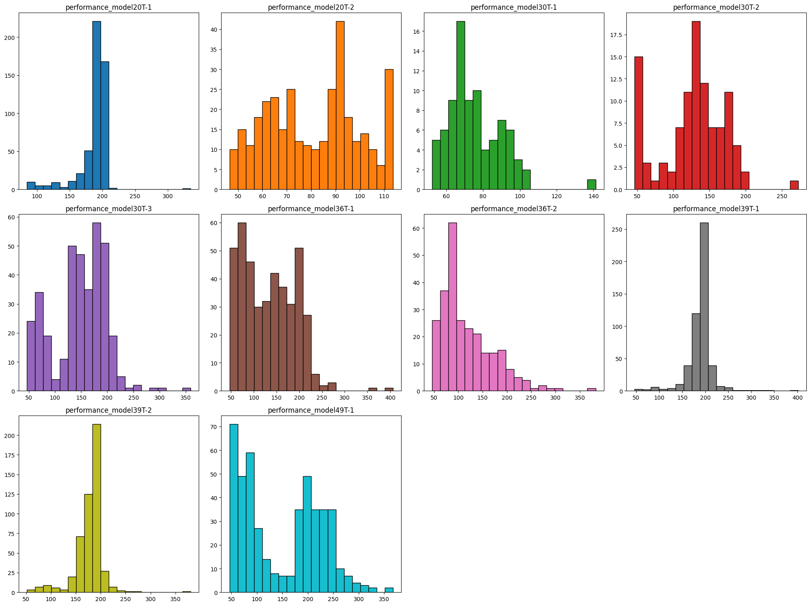

# 📘 Machine Learning for Production Prediction

This repository contains a **Python Jupyter Notebook** for developing a **Machine Learning model to predict mining production**.  
The workflow covers the entire pipeline: from data preprocessing to model training, hyperparameter optimization, and model interpretability using **SHAP values**.  

---

## 📂 Notebook Structure

1. **Data Loading & Exploration**  
   - Importing CSV/Excel datasets.  
   - Cleaning, formatting dates, and setting temporal index.  
   - Initial exploratory analysis.
     
2. **Preprocessing**  
   - Optional **logarithmic transformations** on features.  
   - Feature scaling (`StandardScaler`).  
   - Creation of time-based variables (month, week, etc.).  

3. **Modeling**  
   - Building **pipelines** with different transformations and models:  
     - `RandomForestRegressor` with log-transformed features.  
     - `KNeighborsRegressor` with feature scaling.  
     - Additional models tested: `LassoLars`, `XGBRegressor`, etc.  
   - **Bayesian Optimization** for hyperparameter tuning.  
   - Evaluation with cross-validation using metrics (`RMSE`, `MAE`, `R²`).  

4. **Model Explainability**  
   - Feature importance analysis using **SHAP**.  
   - Functions provided for both `KernelExplainer` and `TreeExplainer`, compatible with pipelines.  

5. ## 📈 Results

### 🔹 Initial Performance (Baseline Models)
- **Unscaled / Unoptimized models** were first evaluated to establish a performance benchmark.  
- Results showed **high variance** in predictive power:
  - Linear models struggled with skewed data distributions.  
  - KNN showed sensitivity to scaling and outliers.  
  - Tree-based models performed better but tended to overfit in some cases.  

📊 *Baseline error distributions (before tuning):*
- RMSE: 45 – 50  
- R²: 0.60 – 0.65  

---

### 🔹 Final Performance (Optimized Pipelines)
After applying **feature engineering (log transforms, scaling)** and **Bayesian Optimization**, performance improved significantly:

- Log transformation stabilized skewed variables.  
- Scaling improved distance-based models (KNN).  
- Hyperparameter tuning reduced overfitting in ensemble models.  

📊 *Optimized error distributions (after tuning):*
- RMSE: 40
- R²: 0.62

---

## ⚙️ Requirements

Python 3.9+ is recommended. Install the required libraries:

```bash
pip install numpy pandas matplotlib seaborn scikit-learn xgboost shap
